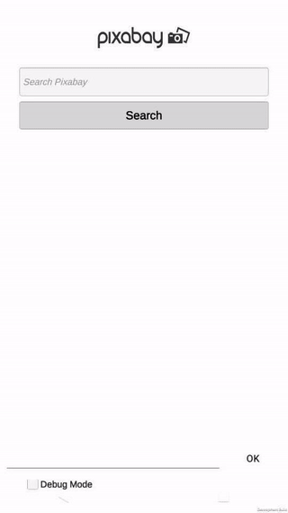
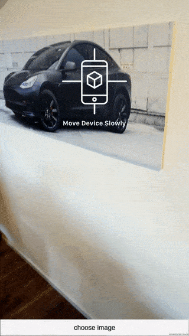
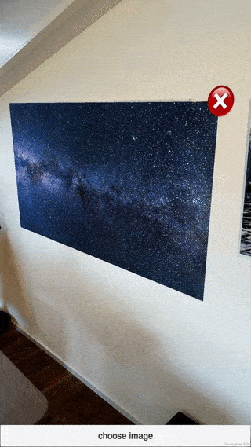
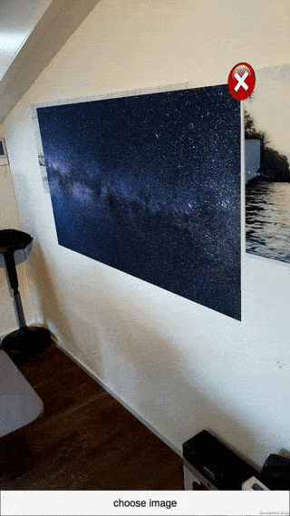

# ARFoundation-Image-On-Plane

Demo Project to place/hang an image on a vertical plane using Unity ARFoundation (ARKit/ARCore)

## Features

### Image Selection
[Pixabay](https://pixabay.com/api/docs/) public API is used to search for an image to place on a wall.

## Vertical Plane Detection  
After an image is selected, the [AR Scene](Assets/Scripts/ARPlaceImageOnPlane.cs) opens and starts searching for vertical planes. 
Once a plane is found, the image gets automatically placed on the plane. The center of the screen is used to control the position on the plane.  

## Touch
The position of the placed image can be modified using touch gestures. 

## Fixed Image
Once satisfied with the current position, a tap on the image fixes it in place. 

## Setup

requirements:
- Unity Editor 2018.3+

dependencies:
- All dependencies are defined in [Packages/manifest.json](Packages/manifest.json)

## Development
To test the plane detection you need a device with ARKit or ARCore support.

The project can also be run in the Editor, the ARPlaceImageScene contains a disabled GameObject "WallDev".
This GameObject simulates a Wall, very useful to test some changes without having to deploy on a mobile device.

Check out the [video](media/unity_editor.mp4) i have made to demonstrate the dev workflow.

### Improvements
I built this code as evaluation of whats currently possible with the ARKit/ARCore frameworks plane detection algorithms.

If you see any abvious improvments i would love to here from you!

## Assets
the project uses the following assets
- [LeanTouch](https://assetstore.unity.com/packages/tools/input-management/lean-touch-30111)
- [Handheld-AR-UX](https://github.com/vishnupg2/Handheld-AR-UX)
